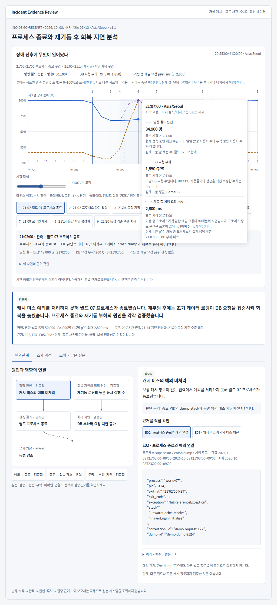

# Incident Evidence Skill

게임·서비스 장애를 **현상 시간축 → 원인·후보 요약 → 인과관계 → 조사 과정 → 근거 → 후속 조치** 순서로 설명하는 재사용 스킬입니다. 한국어를 기본으로 작성하고 영어 보고서도 지원합니다.



## 사용하기

Agent Skills를 지원하는 도구의 스킬 디렉터리에 `skills/investigate-game-incident` 폴더를 복사합니다. ChatGPT Work에서는 `investigate-game-incident` 스킬로 사용할 수 있고, 이 저장소는 이식 가능한 원본입니다.

```text
$investigate-game-incident를 사용해 첨부한 메트릭·로그·DB 정보로 장애 보고서를 작성해줘.
상단에 장애 전후 현상을 공통 시간축으로 배치하고, 원인 후보의 검증 근거와 남은 질문을 기록해줘.
```

분석 자료를 준비한 뒤 스킬이 JSON 입력을 작성하고 검증·렌더링 명령을 실행합니다. 입력 규약은 [report-contract.md](skills/investigate-game-incident/references/report-contract.md)를 참고합니다.

## 예제 실행

Python 3.10 이상, 표준 라이브러리만 필요합니다. 네트워크·API 키·웹 서버는 필요하지 않습니다.

```bash
python skills/investigate-game-incident/scripts/render_report.py \
  skills/investigate-game-incident/assets/example-restart.json \
  --out report.html --markdown-out report.md
```

생성한 `report.html`을 브라우저에서 엽니다. [예시 HTML](examples/restart-recovery.html)과 [Markdown](examples/restart-recovery.md)도 포함합니다. 페이지용 예시는 `docs/index.html`입니다. [예시 보고서 페이지](https://jungrok5.github.io/report/)에서 바로 열어볼 수 있습니다. HTML 파일을 다운로드해서 직접 열 수도 있습니다.

예제 사건과 모든 수치는 가상입니다. 실제 장애 분석 대신 이 예제를 제출하지 마세요.

## GitHub Pages

현재 저장소는 GitHub Actions로 배포됩니다. 복제한 저장소에서는 **Settings → Pages → Build and deployment → Source: GitHub Actions**를 선택합니다. 이후 main에 푸시하거나 Actions의 **Publish example report**를 실행하면 `docs/`만 공개됩니다. `.github/workflows/pages.yml`은 검증을 통과한 예시를 배포합니다. 실제 운영 로그를 공개 예시에 넣지 마세요.

## 상단 시간축

- 동접(명), DB 부하(QPS), 지연(ms)을 같은 X축의 별도 레인에 배치합니다.
- 프로세스 종료, 알림, 재부팅, 로딩, 부하 피크, 로그인 재개, 지연 회복, 동접 회복을 선택할 수 있습니다.
- 사건 선택은 모든 지표의 시각선·당시 관측값·근거를 함께 바꿉니다. 가까운 표본을 표시할 때는 표본의 실제 시각을 함께 표시합니다.
- 관측 누락은 null과 끊어진 선으로 표현합니다. 0으로 대체하지 않습니다.
- 사건 시간축과 조사 시각을 구분합니다. 선후 관계만으로 원인을 확정하지 않습니다.

## 분석 규칙

확정된 원인과 유력 후보, 관측 사실, 미확인 질문을 구분합니다. 노드와 연결 모두 근거 ID를 요구합니다. 질문·가설·예측·조회·관측·판정·다음 확인을 보존합니다. 원본 조회 링크와 당시 결과를 함께 남깁니다. 담당·기한·완료 기준이 있는 후속 조치를 작성합니다.

렌더러는 입력 형식과 참조를 검사하며 원인 진위를 검증하지 않습니다. 자체적으로 Grafana·DB·로그 시스템에 연결하거나 자동 복구하지 않습니다. 원본 링크는 제공된 주소를 사용자가 클릭할 때만 엽니다. 외부 차트·폰트 라이브러리는 포함하지 않습니다.

## 검증

```bash
python -m unittest discover -s skills/investigate-game-incident/scripts -p test_report.py -v
python skills/investigate-game-incident/scripts/validate_report.py \
  skills/investigate-game-incident/assets/example-restart.json
```

선택적 브라우저 점검:

```bash
npm install
npx playwright install chromium
npm run test:browser
```

브라우저 점검은 사건 선택·공통 시각선·근거 전환·조사 과정·320px 레이아웃·관측 누락을 확인합니다. CI 기본 점검은 Python만 사용합니다.

## 구성

- `skills/investigate-game-incident/SKILL.md`: 분석·보고서 작성 절차
- `references/`: 분석 방법, 데이터 규약, 문체, 실데이터 연동
- `assets/`: 렌더링 템플릿과 가상 입력
- `scripts/`: 검증기, HTML/Markdown 생성기, 무결성 테스트
- `examples/`: 읽어볼 수 있는 결과 예제

MIT 라이선스. 보고서에 넣는 외부 로그·메트릭의 권한과 보존 규정은 해당 자료의 조건을 따릅니다.
